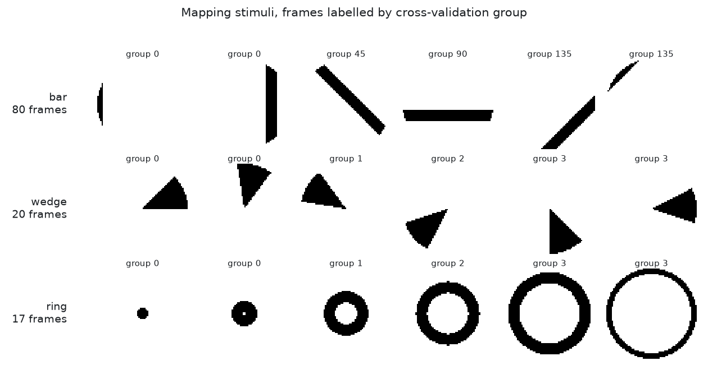
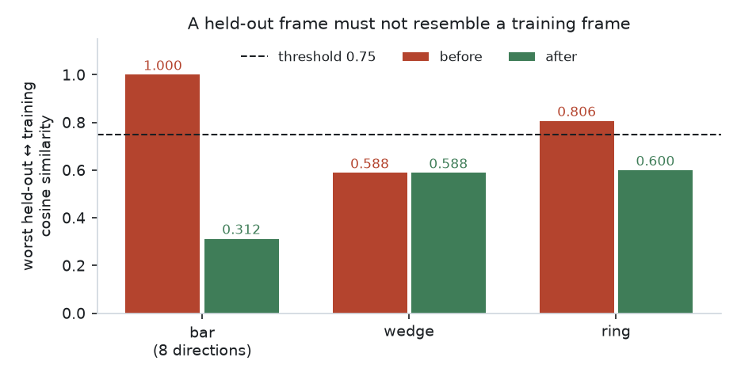
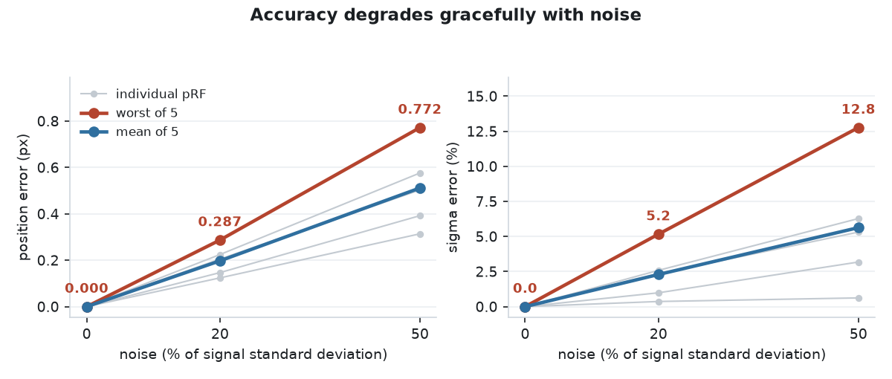
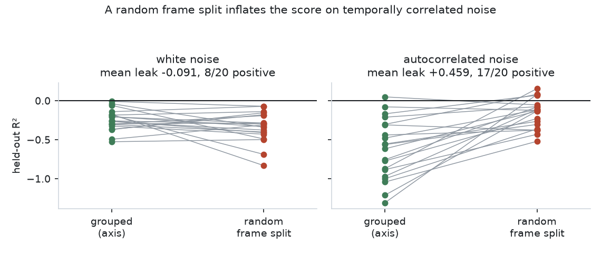

# CortexProbe

[](https://github.com/urmeo/retinonorm/actions/workflows/ci.yml)

**Population receptive fields and lesion effects in convolutional models of the visual hierarchy.**

> **Scope.** The instrument is validated. **No network has been probed.** All four hypotheses —
> pRF size vs depth, size vs eccentricity, lesion-induced distortion, spread across seeded
> instances — are **untested**. A frozen ImageNet CNN is not a biologically realistic model of
> visual cortex; this builds the apparatus such models would need to be evaluated.

---

## Pipeline

```
config ─▶ stimuli ─▶ model ─▶ activations ─▶ prf.fit ─┬─▶ lesion
   │         │                                        ├─▶ individuals
   │         └── CV groups ──▶ prf.validation ────────┴─▶ evaluation ─▶ report
   └── SHA-256 digest ─────────────────────────────────────▶ results/
```

| Stage | Module | State |
|---|---|---|
| Run config, digest, IO | `config.py` | done |
| Visual field coordinates | `geometry.py` | done |
| Bar / wedge / ring apertures, CV groups | `stimuli.py` | done |
| Gaussian pRF, predicted response | `prf/model.py` | done |
| Two-stage fit, uncertainty, diagnostics | `prf/fit.py` | done |
| Grouped cross-validation | `prf/validation.py` | done |
| Result container, Parquet IO | `prf/result.py` | not started |
| Network loading, layer taps | `models.py` | not started |
| Activation extraction | `activations.py` | not started |
| Lesion operators | `lesion.py` | not started |
| Seeded instances | `individuals.py` | not started |
| H1–H4 statistics | `evaluation.py` | not started |
| Maps, plots, report | `viz.py` | not started |
| Command line | `cli.py` | not started |

---

## Stimuli



| Design | Frames | CV groups | Grouped by |
|---|---|---|---|
| bar | 80 | 4 | sweep axis, `direction % 180` |
| wedge | 20 | 4 | start angle, overlap-pruned |
| ring | 17 | 4 | eccentricity block, overlap-pruned |

---

## Fold integrity



- A bar sweep at `d` and at `d+180` are **bit-identical**: the projection negates, the offsets are symmetric.
- Grouping by direction put those copies in **different folds** — worst-case similarity **1.000**.
- Grouping by axis: **0.312**. Wedge **0.588** (already under threshold). Ring **0.806 → 0.600**.
- Threshold `max_fold_similarity = 0.75` lives in the config, so it is part of the run digest.
- Asserted against the **default** config, not just the test fixture.

---

## Results

**These validate the instrument, not any scientific claim.** No network has been probed.
Tables are generated by `scripts/generate_validation_report.py`; CI fails if one stops reproducing.

Config: 64 px field · 80 frames · 4 directions · 300 candidates · `grid_size=10` · `sigma ∈ [1, 10]` px.

### Recovery of known pRFs



<!-- BEGIN GENERATED: recovery -->
| Condition | Position error, worst (px) | mean (px) | Sigma error, worst (%) | mean (%) | Minimum R² |
|---|---|---|---|---|---|
| Noiseless | 0.000 | 0.000 | 0.0 | 0.0 | 1.0000 |
| 20% noise | 0.287 | 0.197 | 5.2 | 2.3 | 0.9696 |
| 50% noise | 0.772 | 0.511 | 12.8 | 5.6 | 0.8326 |
| Pure noise | — | — | — | — | **40 / 40 rejected** |

Worst and mean are taken over n = 5 ground-truth pRFs. On pure noise the fitter accepted none of 40 units, and its best spurious R² was 0.1947, below the 0.2 acceptance threshold.

<sub>Recorded on macOS-26.6.1 arm64, Python 3.12.13, NumPy 2.5.2, SciPy 1.18.0 | config digest `4d6a856a499e` | generated 2026-08-19</sub>
<!-- END GENERATED: recovery -->

### Parameter uncertainty

<!-- BEGIN GENERATED: uncertainty -->
| Noise | Fitted x0 | SE | 95 % CI width |
|---|---|---|---|
| 0.0 | 12.000 | 0.0000 | 0.000 |
| 0.1 | 11.962 | 0.0961 | 0.383 |
| 0.3 | 11.909 | 0.2806 | 1.118 |
| 0.6 | 11.881 | 0.5354 | 2.133 |

The noiseless row is a numerical floor, not a measurement: the residual is at machine precision, so the linearised interval collapses. It is shown to make the scaling of the rows below it legible.

Empirical coverage of the nominal 95% interval:

| Position | Noise | n | Coverage | 95 % binomial CI |
|---|---|---|---|---|
| interior | 0.2 | 200 | 0.935 | [0.901, 0.969] |
| interior | 0.5 | 200 | 0.930 | [0.895, 0.965] |
| near edge | 0.2 | 200 | 0.930 | [0.895, 0.965] |
| near edge | 0.5 | 200 | 0.915 | [0.876, 0.954] |

Coverage runs slightly under nominal, and lowest near the field edge at high noise, where the linearisation behind the interval is weakest.

<sub>Recorded on macOS-26.6.1 arm64, Python 3.12.13, NumPy 2.5.2, SciPy 1.18.0 | config digest `4d6a856a499e` | generated 2026-08-19</sub>
<!-- END GENERATED: uncertainty -->

### Cross-validation and leakage



<!-- BEGIN GENERATED: cross_validation -->
| Response | n seeds | Grouped CV | Random-split CV | Leak | Leak positive |
|---|---|---|---|---|---|
| White | 20 | -0.248 ± 0.135 | -0.339 ± 0.192 | -0.091 ± 0.231 | 8 / 20 |
| Autocorrelated | 20 | -0.624 ± 0.385 | -0.164 ± 0.189 | +0.459 ± 0.402 | 17 / 20 |

Mean ± SD over seeds 21–40. The carrier is a width-3 boxcar, whose lag-1 autocorrelation measured 0.651 ± 0.086 against a theoretical 0.667.

<sub>Recorded on macOS-26.6.1 arm64, Python 3.12.13, NumPy 2.5.2, SciPy 1.18.0 | config digest `4d6a856a499e` | generated 2026-08-19</sub>
<!-- END GENERATED: cross_validation -->

### Runtime

<!-- BEGIN GENERATED: runtime -->
| Units | Fit (s) | Per unit (ms) | CV (s) | CV factor |
|---|---|---|---|---|
| 1 | 0.008 | 8.2 | 0.036 | 4.4× |
| 10 | 0.073 | 7.3 | 0.379 | 5.2× |
| 100 | 0.765 | 7.7 | 3.958 | 5.2× |

Per-unit cost is flat, so nothing quadratic hides in the loop. Cross-validation costs a roughly constant factor: 4 folds plus the full fit. On this machine 10 000 units extrapolate to about 1.3 minutes single-threaded. Timings are hardware-specific; the environment is recorded below.

<sub>Recorded on macOS-26.6.1 arm64, Python 3.12.13, NumPy 2.5.2, SciPy 1.18.0 | config digest `4d6a856a499e` | generated 2026-08-19</sub>
<!-- END GENERATED: runtime -->

---

## Design decisions

- **Unit-volume Gaussians** — normalised by `1/(2πσ²)`; unit-peak would make overlap grow with σ by construction, making H1 true by parameterisation.
- **σ bounded both ends** — floor 1 px: below the pixel pitch the sum depends on sub-pixel position, running **0.031** between pixels to **3.979** on a pixel centre, so it overshoots as badly as it undershoots. Ceiling ≈ `resolution/6.1`: beyond it the field truncates the Gaussian (σ=20 on 64 px retains 0.723, σ=40 retains 0.275).
- **Amplitude projected, not searched** — closed-form least squares for `beta`, `baseline`; optimiser explores only `x0, y0, σ`.
- **`beta > 0` required** — a suppressed unit fits a flawless pRF with the sign reversed (`beta=-3.000`, `R²=1.0000`).
- **`converged` ≠ `accepted`** — `converged` is the optimiser; `accepted` adds R² threshold, positive amplitude, σ not pinned. Centre at the field edge stays accepted; pinned σ does not.
- **Degrees of freedom count distinct frames** — a frame shown twice is not a second observation; counting duplicates understated SE by √2.
- **Misspecification reported, not enforced** — `second_field_r2`: single-lobe 0.000–0.023, pure noise 0.056, two-lobe 0.206–0.473 (margin narrows as noise grows; no cut is claimed to transfer).

[Full records: `docs/adr/`](docs/adr/)

---

## Verify

```bash
python3 -m pip install -e '.[dev]'
python3 -m pytest -q --cov
```

| Gate | Result |
|---|---|
| `ruff format --check .` | pass |
| `ruff check .` | pass |
| `mypy` (strict) | pass |
| `pytest --cov` | **221 tests**, **99.7 %** branch coverage (floor 85 %) |
| Python | 3.9 and 3.12, both in CI |

| Suite | Tests | Establishes |
|---|---|---|
| `test_config.py` | 42 | Every guard fires; digest stable and sensitive |
| `test_prf_edge_cases.py` | 42 | Bounds, suppression, misspecification, degenerate input |
| `test_stimuli.py` | 37 | **No held-out frame resembles a training frame** |
| `test_cross_validation.py` | 19 | Whole-group folds; leakage mechanism pinned |
| `test_prf_recovery.py` | 18 | Known parameters recovered; noise rejected |
| `test_geometry.py` | 18 | Coordinate conventions |
| `test_prf_uncertainty.py` | 17 | Errors scale with noise; interval coverage calibrated |
| `test_prf_designs.py` | 15 | Recovery across designs and pRF sizes |
| `test_prf_model.py` | 13 | Unit volume; prediction is the overlap it claims |

---

## Reproduce

```bash
python3 scripts/generate_validation_report.py          # rewrite tables + results/
python3 scripts/generate_validation_report.py --check  # verify, write nothing
python3 -m pip install -e '.[viz]' && python3 scripts/generate_figures.py
```

- Every number above comes from [`results/validation.json`](results/validation.json); tables also in [`results/VALIDATION.md`](results/VALIDATION.md).
- `--check` re-measures and compares within tolerance, then confirms the tables were rendered from those numbers. CI runs it on **3.9 and 3.12**.
- All measurements except runtime reproduce **byte-identically** across Python 3.9–3.12 and NumPy/SciPy versions.
- Config digest `4d6a856a499e` — [`configs/validation.json`](configs/validation.json).

---

## Reference

Dumoulin, S. O., & Wandell, B. A. (2008). Population receptive field estimates in human visual
cortex. *NeuroImage*, 39(2), 647–660.

MIT — [`LICENSE`](LICENSE) · [`CITATION.cff`](CITATION.cff)
