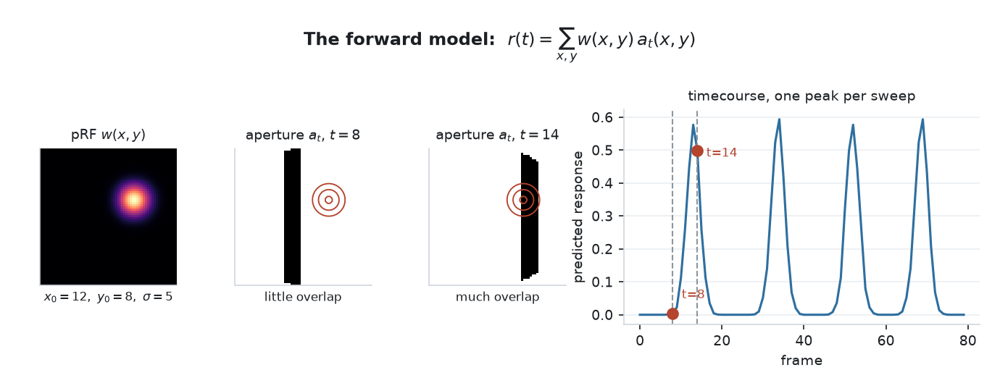
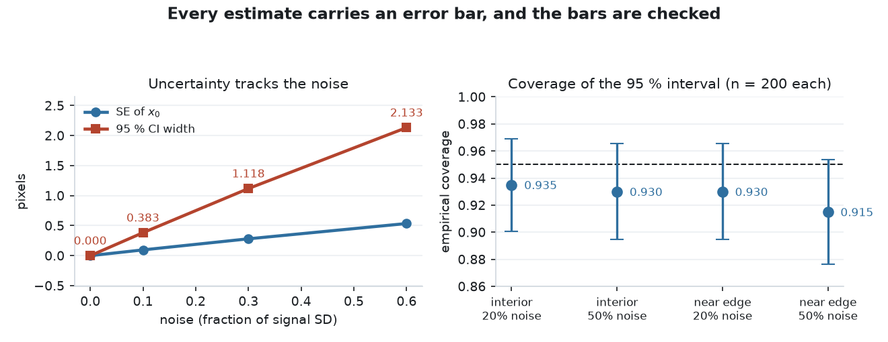
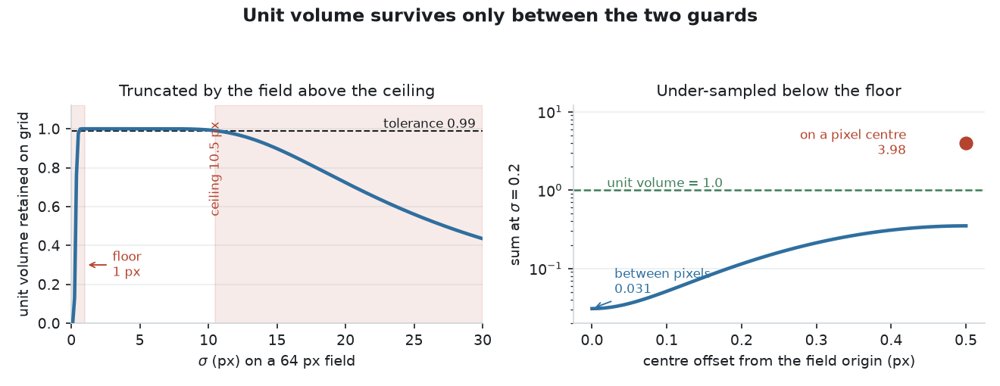
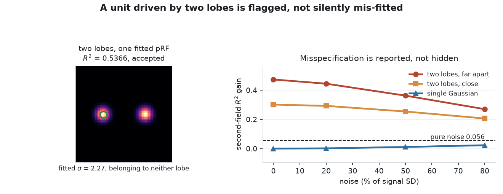
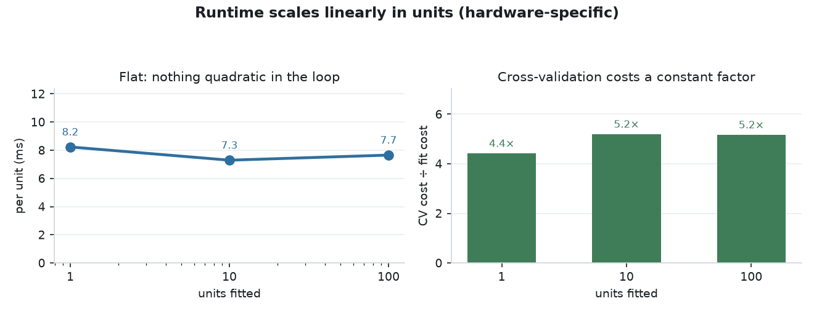

# CortexProbe

### Held-out or it does not count: a pRF instrument validated against its own failure modes

**Population receptive fields and lesion effects in convolutional models of the visual hierarchy.**

[](https://github.com/urmeo/retinonorm/actions/workflows/ci.yml)


[Validation report](results/VALIDATION.md) · [Design records](docs/adr/) · [Build spec](docs/BUILD_SPEC.md) · [Plan](docs/PLAN.md)



> **Scope.** The instrument is validated. **No network has been probed.** All four hypotheses —
> pRF size vs depth, size vs eccentricity, lesion-induced distortion, spread across seeded
> instances — are **untested**. A frozen ImageNet CNN is not a biologically realistic model of
> visual cortex; this builds the apparatus such models would need to be evaluated.

---

## What this is

- Measures **population receptive fields** in convolutional units with the procedure human fMRI uses (Dumoulin & Wandell, 2008): sweep an aperture, record the timecourse, fit a 2-D Gaussian.
- Output is a *measured* pRF for an artificial unit, in the same units as the human quantity — so lesions and seed-to-seed variation become measurable, not asserted.
- Needs no restricted data. Stimuli are generated in-repo, the "brain" is a frozen network, every number reproduces on a laptop.
- Built to **refuse its own bad answers**: noise, suppressed units, truncated Gaussians and leaky folds are all rejected or flagged rather than reported.

---

## Quickstart

```bash
python3 -m pip install -e '.[dev]'
```

Fit a pRF to a synthetic unit, end to end:

```python
import numpy as np
from cortexprobe import StimulusConfig, FitConfig
from cortexprobe.geometry import Grid
from cortexprobe.stimuli import build_apertures
from cortexprobe.prf.fit import PRFFitter
from cortexprobe.prf.model import GaussianReceptiveField, predict

grid      = Grid(64)                                   # 64 px circular visual field
sequence  = build_apertures(StimulusConfig(resolution=64, n_steps=20,
                                           directions=(0, 45, 90, 135)))
apertures = sequence.as_float()                        # (80, 64, 64) bar sweeps
fitter    = PRFFitter(grid, apertures, FitConfig(grid_size=10, sigma_bounds=(1.0, 10.0)))

# a unit whose true pRF sits at (12, 8) with sigma 5
truth    = GaussianReceptiveField(12.0, 8.0, 5.0)
response = 3.0 * predict(truth.weights(grid), apertures) + 0.5

fit = fitter.fit_unit(response)

print(fit.x0, fit.y0, fit.sigma, fit.r2, fit.accepted)
# 12.0 8.0 5.0 1.0 True          recovered exactly: this unit is noiseless

print(fit.second_field_r2)
# 3.2e-33                        no second pRF would explain anything more

print(fit.confidence_interval("x0"))
# (11.999999999999998, 12.000000000000002)
# A perfect fit gives a degenerate interval — the residual is at machine precision.
# Add noise and it widens: see the uncertainty table below.
```

Swap `response` for a real activation timecourse and the same call measures a network unit —
that is the whole interface. `fit_all(activations)` takes a `(frames, units)` matrix.

To hold data out honestly, cross-validate by sweep group rather than by frame:

```python
from cortexprobe.prf.validation import CrossValidator

validator = CrossValidator(grid, apertures, sequence.group, FitConfig(grid_size=10,
                                                                     sigma_bounds=(1.0, 10.0)))
print(validator.validate_unit(response).cv_r2)
```

---

## Instrument validation

Each row is a way the instrument could return a confident wrong answer. Each is measured, and each is a test.

<table width="820">
<tr><th align="left" width="190">Check</th><th align="left" width="270">Question</th><th align="left" width="360">Result</th></tr>
<tr><td>Ground-truth recovery</td><td>Can it recover a pRF it generated itself?</td><td><b>0.000 px</b> noiseless; worst <b>0.772 px</b> at 50 % noise</td></tr>
<tr><td>Noise rejection</td><td>Does it refuse a pRF that isn't there?</td><td><b>40 / 40 rejected</b>; best spurious R² 0.1947 &lt; 0.2</td></tr>
<tr><td>Suppression</td><td>Is a unit that <i>dims</i> reported as a pRF?</td><td>Rejected — β = −3.000 <b>despite R² = 1.0000</b></td></tr>
<tr><td>Fold leakage</td><td>Does "held out" mean held out?</td><td>Worst held-out↔train cosine <b>1.000 → 0.312</b></td></tr>
<tr><td>Split leakage</td><td>Does a random frame split inflate the score?</td><td><b>+0.459 ± 0.402</b> on correlated noise, 17/20 seeds</td></tr>
<tr><td>Interval coverage</td><td>Do the 95 % intervals actually cover?</td><td><b>0.915 – 0.935</b> measured, n = 200 per cell</td></tr>
<tr><td>Misspecification</td><td>Is a two-lobed unit flagged?</td><td>Yes — 0.206 – 0.473 vs ≤ 0.023 for one lobe</td></tr>
<tr><td>Unit volume</td><td>Is the Gaussian normalised on the grid?</td><td>Guarded both ends: 1 px floor, <code>resolution/6.1</code> ceiling</td></tr>
<tr><td>Degrees of freedom</td><td>Is a repeated frame a second observation?</td><td>No — distinct frames only, else SE is √2 too small</td></tr>
</table>

**Three of these were defects found and fixed during validation, not design choices made up front.** Grouping folds by sweep direction put bit-identical frames on both sides of every boundary; a suppressed unit fitted a flawless pRF with the sign reversed; duplicate frames shrank every error bar by 30 %. Each is now a test.

---

## Results

**These validate the instrument, not any scientific claim.** Tables are generated by
`scripts/generate_validation_report.py` and re-checked in CI — a number that stops reproducing
fails the build.

Configuration: 64 px field · 80 frames · 4 sweep directions · 300 candidates · `grid_size=10` · `σ ∈ [1, 10]` px.

### Recovery of known pRFs

<!-- BEGIN GENERATED: recovery -->
| Condition | Position error, worst (px) | mean (px) | Sigma error, worst (%) | mean (%) | Minimum R² |
|---|---|---|---|---|---|
| Noiseless | 0.000 | 0.000 | 0.0 | 0.0 | 1.0000 |
| 20% noise | 0.287 | 0.197 | 5.2 | 2.3 | 0.9696 |
| 50% noise | 0.772 | 0.511 | 12.8 | 5.6 | 0.8326 |
| Pure noise | — | — | — | — | **40 / 40 rejected** |

Worst and mean are taken over n = 5 ground-truth pRFs. On pure noise the fitter accepted none of 40 units, and its best spurious R² was 0.1947, below the 0.2 acceptance threshold.

<sub>Recorded on macOS-26.6.1 arm64, Python 3.12.13, NumPy 2.5.2, SciPy 1.18.0 | config digest `4d6a856a499e` | generated 2026-08-19</sub>
<!-- END GENERATED: recovery -->

### Parameter uncertainty

<!-- BEGIN GENERATED: uncertainty -->
| Noise | Fitted x0 | SE | 95 % CI width |
|---|---|---|---|
| 0.0 | 12.000 | 0.0000 | 0.000 |
| 0.1 | 11.962 | 0.0961 | 0.383 |
| 0.3 | 11.909 | 0.2806 | 1.118 |
| 0.6 | 11.881 | 0.5354 | 2.133 |

The noiseless row is a numerical floor, not a measurement: the residual is at machine precision, so the linearised interval collapses. It is shown to make the scaling of the rows below it legible.

Empirical coverage of the nominal 95% interval:

| Position | Noise | n | Coverage | 95 % binomial CI |
|---|---|---|---|---|
| interior | 0.2 | 200 | 0.935 | [0.901, 0.969] |
| interior | 0.5 | 200 | 0.930 | [0.895, 0.965] |
| near edge | 0.2 | 200 | 0.930 | [0.895, 0.965] |
| near edge | 0.5 | 200 | 0.915 | [0.876, 0.954] |

Coverage runs slightly under nominal, and lowest near the field edge at high noise, where the linearisation behind the interval is weakest.

<sub>Recorded on macOS-26.6.1 arm64, Python 3.12.13, NumPy 2.5.2, SciPy 1.18.0 | config digest `4d6a856a499e` | generated 2026-08-19</sub>
<!-- END GENERATED: uncertainty -->

### Cross-validation and leakage

<!-- BEGIN GENERATED: cross_validation -->
| Response | n seeds | Grouped CV | Random-split CV | Leak | Leak positive |
|---|---|---|---|---|---|
| White | 20 | -0.248 ± 0.135 | -0.339 ± 0.192 | -0.091 ± 0.231 | 8 / 20 |
| Autocorrelated | 20 | -0.624 ± 0.385 | -0.164 ± 0.189 | +0.459 ± 0.402 | 17 / 20 |

Mean ± SD over seeds 21–40. The carrier is a width-3 boxcar, whose lag-1 autocorrelation measured 0.651 ± 0.086 against a theoretical 0.667.

<sub>Recorded on macOS-26.6.1 arm64, Python 3.12.13, NumPy 2.5.2, SciPy 1.18.0 | config digest `4d6a856a499e` | generated 2026-08-19</sub>
<!-- END GENERATED: cross_validation -->

### Runtime

<!-- BEGIN GENERATED: runtime -->
| Units | Fit (s) | Per unit (ms) | CV (s) | CV factor |
|---|---|---|---|---|
| 1 | 0.008 | 8.2 | 0.036 | 4.4× |
| 10 | 0.073 | 7.3 | 0.379 | 5.2× |
| 100 | 0.765 | 7.7 | 3.958 | 5.2× |

Per-unit cost is flat, so nothing quadratic hides in the loop. Cross-validation costs a roughly constant factor: 4 folds plus the full fit. On this machine 10 000 units extrapolate to about 1.3 minutes single-threaded. Timings are hardware-specific; the environment is recorded below.

<sub>Recorded on macOS-26.6.1 arm64, Python 3.12.13, NumPy 2.5.2, SciPy 1.18.0 | config digest `4d6a856a499e` | generated 2026-08-19</sub>
<!-- END GENERATED: runtime -->

---

## Graphs and charts

<table width="820">
<tr>
<td align="center" width="273"><br><sub><b>Recovery</b> — error grows gracefully</sub></td>
<td align="center" width="273"><br><sub><b>Uncertainty</b> — and its coverage</sub></td>
<td align="center" width="273"><br><sub><b>Leakage</b> — grouped vs random split</sub></td>
</tr>
<tr>
<td align="center" width="273"><br><sub><b>Fold integrity</b> — 1.000 → 0.312</sub></td>
<td align="center" width="273"><br><sub><b>Unit volume</b> — guarded both ends</sub></td>
<td align="center" width="273"><br><sub><b>Misspecification</b> — two lobes flagged</sub></td>
</tr>
<tr>
<td align="center" width="273"><br><sub><b>Stimuli</b> — bar, wedge, ring</sub></td>
<td align="center" width="273"><br><sub><b>Forward model</b> — pRF × aperture</sub></td>
<td align="center" width="273"><br><sub><b>Runtime</b> — flat per unit</sub></td>
</tr>
</table>

Every figure is drawn by `scripts/generate_figures.py`, from the same configuration and the same
measurement code as the tables above, so a figure cannot disagree with the table beside it.

---

## How it works

```
config ─▶ stimuli ─▶ model ─▶ activations ─▶ prf.fit ─┬─▶ lesion
   │         │                                        ├─▶ individuals
   │         └── CV groups ──▶ prf.validation ────────┴─▶ evaluation ─▶ report
   └── SHA-256 digest ─────────────────────────────────────▶ results/
```

<table width="820">
<tr><th align="left" width="200">Step</th><th align="left" width="620">What happens</th></tr>
<tr><td>1 · Stimulus</td><td>A bar, wedge or ring aperture sweeps a circular visual field; frames are labelled with the cross-validation group they belong to</td></tr>
<tr><td>2 · Prediction</td><td>A candidate pRF <code>w(x,y)</code> predicts <code>r(t) = Σ w · a<sub>t</sub></code> — the overlap of the field with each aperture</td></tr>
<tr><td>3 · Coarse search</td><td>300 candidates on a grid of positions × log-spaced sigmas pick the basin</td></tr>
<tr><td>4 · Refine</td><td>Bounded trust-region least squares on <code>(x₀, y₀, σ)</code>; amplitude and baseline are projected, never searched</td></tr>
<tr><td>5 · Accept or reject</td><td>R² threshold, positive amplitude, σ off its bound — otherwise not a pRF</td></tr>
<tr><td>6 · Validate</td><td>Leave-one-sweep-axis-out CV; train-fold amplitude applied unchanged to test frames</td></tr>
</table>

### Stimulus designs

<table width="820">
<tr><th align="left" width="140">Design</th><th align="left" width="110">Frames</th><th align="left" width="110">CV groups</th><th align="left" width="240">Grouped by</th><th align="left" width="220">Worst held-out overlap</th></tr>
<tr><td>bar</td><td>80</td><td>4</td><td>sweep axis, <code>direction % 180</code></td><td>0.312</td></tr>
<tr><td>wedge</td><td>20</td><td>4</td><td>start angle, overlap-pruned</td><td>0.588</td></tr>
<tr><td>ring</td><td>17</td><td>4</td><td>eccentricity block, overlap-pruned</td><td>0.600</td></tr>
</table>

A bar sweep at `d` and at `d + 180°` are **bit-identical** — the projection negates and the offsets
are symmetric. Grouping by direction put those copies in different folds, so every held-out frame
appeared verbatim in training. Grouping by *axis* fixes it; ring and wedge additionally drop the
frames that still overlap a training frame above `max_fold_similarity = 0.75`, which lives in the
config and therefore in the run digest.

---

## Design decisions

<table width="820">
<tr><th align="left" width="230">Decision</th><th align="left" width="590">Why</th></tr>
<tr><td>Unit-volume Gaussians</td><td>Normalised by <code>1/(2πσ²)</code>. Unit-<i>peak</i> would make overlap grow with σ by construction, making "pRF size increases with depth" true by parameterisation instead of measured</td></tr>
<tr><td>σ bounded at both ends</td><td>Floor 1 px: below the pixel pitch the sum runs <b>0.031</b> between pixels to <b>3.979</b> on a pixel centre. Ceiling <code>≈ resolution/6.1</code>: beyond it the field truncates the Gaussian (σ=20 on 64 px retains 0.723)</td></tr>
<tr><td>Amplitude projected, not searched</td><td>Closed-form least squares for β and baseline; the optimiser explores only three parameters, removing a family of local minima</td></tr>
<tr><td>β &gt; 0 required</td><td>A suppressed unit fits a flawless pRF with the sign reversed. Surround suppression and normalisation both produce them in a real network</td></tr>
<tr><td><code>converged</code> ≠ <code>accepted</code></td><td><code>converged</code> is the optimiser; <code>accepted</code> adds the R² threshold, positive amplitude and σ off its bound. A centre at the field edge stays accepted; a pinned σ does not</td></tr>
<tr><td>dof counts distinct frames</td><td>A frame shown twice is not a second observation. Counting duplicates understated every standard error by √2</td></tr>
<tr><td>Misspecification reported, not enforced</td><td><code>second_field_r2</code> exposes the R² a second pRF would add. Downstream analysis picks its own cut and states it</td></tr>
</table>

Full records with measurements: [`docs/adr/`](docs/adr/)

---

## Module status

<table width="820">
<tr><th align="left" width="330">Stage</th><th align="left" width="220">Module</th><th align="left" width="130">State</th><th align="left" width="140">Coverage</th></tr>
<tr><td>Run config, digest, IO</td><td><code>config.py</code></td><td>✅ done</td><td>100 %</td></tr>
<tr><td>Visual field coordinates</td><td><code>geometry.py</code></td><td>✅ done</td><td>100 %</td></tr>
<tr><td>Bar / wedge / ring apertures, CV groups</td><td><code>stimuli.py</code></td><td>✅ done</td><td>100 %</td></tr>
<tr><td>Gaussian pRF, predicted response</td><td><code>prf/model.py</code></td><td>✅ done</td><td>100 %</td></tr>
<tr><td>Two-stage fit, uncertainty, diagnostics</td><td><code>prf/fit.py</code></td><td>✅ done</td><td>99 %</td></tr>
<tr><td>Grouped cross-validation</td><td><code>prf/validation.py</code></td><td>✅ done</td><td>100 %</td></tr>
<tr><td>Result container, Parquet IO</td><td><code>prf/result.py</code></td><td>⬜ not started</td><td>—</td></tr>
<tr><td>Network loading, layer taps</td><td><code>models.py</code></td><td>⬜ not started</td><td>—</td></tr>
<tr><td>Activation extraction</td><td><code>activations.py</code></td><td>⬜ not started</td><td>—</td></tr>
<tr><td>Lesion operators</td><td><code>lesion.py</code></td><td>⬜ not started</td><td>—</td></tr>
<tr><td>Seeded instances</td><td><code>individuals.py</code></td><td>⬜ not started</td><td>—</td></tr>
<tr><td>H1–H4 statistics</td><td><code>evaluation.py</code></td><td>⬜ not started</td><td>—</td></tr>
<tr><td>Maps, plots, report</td><td><code>viz.py</code></td><td>⬜ not started</td><td>—</td></tr>
<tr><td>Command line</td><td><code>cli.py</code></td><td>⬜ not started</td><td>—</td></tr>
</table>

---

## Verify

```bash
python3 -m pip install -e '.[dev]'
python3 -m pytest -q --cov
```

<table width="820">
<tr><th align="left" width="330">Gate</th><th align="left" width="490">Result</th></tr>
<tr><td><code>ruff format --check .</code></td><td>pass</td></tr>
<tr><td><code>ruff check .</code></td><td>pass</td></tr>
<tr><td><code>mypy</code> (strict)</td><td>pass — 9 source files</td></tr>
<tr><td><code>pytest --cov</code></td><td><b>243 tests</b>, <b>99.7 %</b> branch coverage (floor 85 %)</td></tr>
<tr><td>Python</td><td>3.9 and 3.12, both in CI, no <code>continue-on-error</code></td></tr>
</table>

<table width="820">
<tr><th align="left" width="270">Suite</th><th align="left" width="90">Tests</th><th align="left" width="460">What it establishes</th></tr>
<tr><td><code>test_config.py</code></td><td>42</td><td>Every guard fires; digest stable and sensitive to nested change</td></tr>
<tr><td><code>test_prf_edge_cases.py</code></td><td>56</td><td>Bounds, suppression, misspecification, degenerate and hostile input</td></tr>
<tr><td><code>test_stimuli.py</code></td><td>43</td><td><b>No held-out frame resembles a training frame</b>, default config included</td></tr>
<tr><td><code>test_cross_validation.py</code></td><td>19</td><td>Whole-group folds; the leakage mechanism pinned to a distribution</td></tr>
<tr><td><code>test_prf_recovery.py</code></td><td>18</td><td>Known parameters recovered; noise rejected</td></tr>
<tr><td><code>test_geometry.py</code></td><td>18</td><td>Coordinate conventions and the field mask</td></tr>
<tr><td><code>test_prf_uncertainty.py</code></td><td>17</td><td>Errors scale with noise; interval coverage calibrated at n = 200</td></tr>
<tr><td><code>test_prf_designs.py</code></td><td>15</td><td>Recovery across bar, wedge, ring and across pRF sizes</td></tr>
<tr><td><code>test_prf_model.py</code></td><td>15</td><td>Unit volume; linearity; translation equivariance</td></tr>
</table>

---

## Reproduce

```bash
python3 scripts/generate_validation_report.py          # rewrite tables + results/
python3 scripts/generate_validation_report.py --check  # verify, write nothing
python3 -m pip install -e '.[viz]' && python3 scripts/generate_figures.py
python3 benchmarks/benchmark_scaling.py                # runtime scaling
```

- Every number above comes from [`results/validation.json`](results/validation.json); the same tables are in [`results/VALIDATION.md`](results/VALIDATION.md).
- `--check` re-measures and compares within tolerance, then confirms the tables were rendered from those numbers. **CI runs it on 3.9 and 3.12.**
- All measurements except runtime reproduce **byte-identically** across Python 3.9–3.12 and NumPy/SciPy versions.
- Config digest `4d6a856a499e` — [`configs/validation.json`](configs/validation.json).

---

## Tech stack

<table width="820">
<tr><th align="left" width="230">Area</th><th align="left" width="590">Tools</th></tr>
<tr><td>Numerics</td><td>NumPy, SciPy (<code>optimize.least_squares</code>, trust-region reflective; <code>stats.t</code>)</td></tr>
<tr><td>Figures</td><td>Matplotlib — optional <code>viz</code> extra, deliberately outside CI</td></tr>
<tr><td>Networks (planned)</td><td>PyTorch, torchvision — optional <code>models</code> extra</td></tr>
<tr><td>Result IO (planned)</td><td>pandas, pyarrow — optional <code>io</code> extra</td></tr>
<tr><td>Tooling</td><td>GitHub Actions, ruff, mypy (strict), pytest, coverage</td></tr>
</table>

---

## Limitations

- **No network has been probed.** Every number here is instrument validation on synthetic ground truth. The four hypotheses are untested.
- A frozen ImageNet CNN has no recurrence, no separate excitatory and inhibitory populations, and no cortical magnification. It is not a model of visual cortex.
- No haemodynamic response is convolved — a CNN has none. This departs from the fMRI procedure deliberately, and is why a sweep and its 180° return are identical.
- Interval coverage runs slightly under nominal (0.915–0.935 against 0.95), lowest near the field edge, where the linearisation behind it is weakest.
- The misspecification diagnostic separates cleanly at low noise and narrows at high noise; no cut is claimed to transfer to another stimulus or lobe geometry.
- Runtime figures are single-run and hardware-specific. They carry the machine, not an error bar.

---

## Future work

- `models.py` and `activations.py` — frozen network loading and hooked activation extraction, the first point at which a real pRF is measured.
- `lesion.py` — silence units in an early layer, refit downstream pRFs, quantify the artificial scotoma.
- `individuals.py` — independently seeded instances as a measurable individual-difference axis.
- Vectorise the coarse search across candidates; roughly an order of magnitude on the dominant stage, worth doing before 10 000-unit layers.

---

## References

**Method.** Dumoulin, S. O., & Wandell, B. A. (2008). Population receptive field estimates in
human visual cortex. *NeuroImage*, 39(2), 647–660. The pRF estimation procedure this project
applies unchanged to convolutional units.

**Why held-out matters.** Kriegeskorte, N., Simmons, W. K., Bellgowan, P. S. F., & Baker, C. I.
(2009). Circular analysis in systems neuroscience: the dangers of double dipping.
*Nature Neuroscience*, 12(5), 535–540. The failure mode the cross-validation design exists to
avoid.

**In this repository.** [Design records](docs/adr/) · [Build specification](docs/BUILD_SPEC.md) ·
[Plan](docs/PLAN.md) · [Validation report](results/VALIDATION.md)

---

## Licence

MIT — [`LICENSE`](LICENSE) · citation metadata in [`CITATION.cff`](CITATION.cff)
