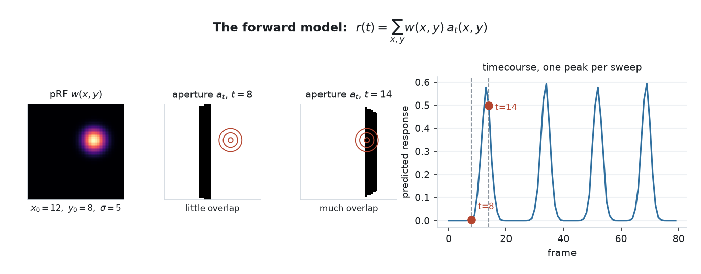
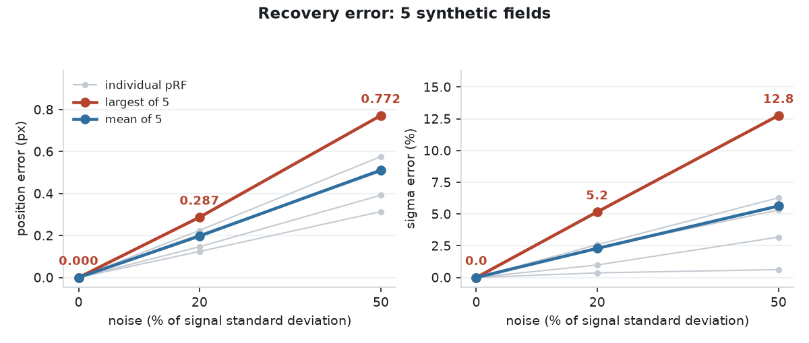
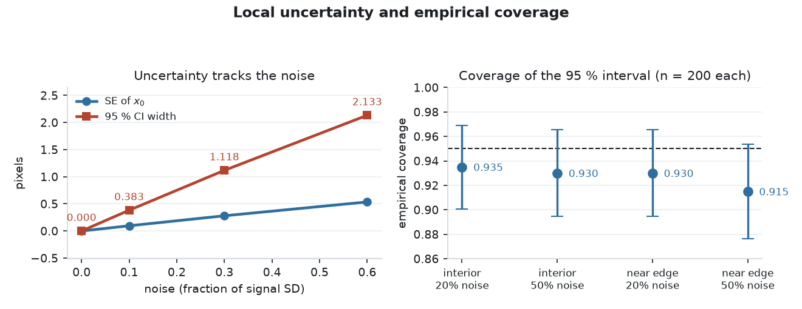
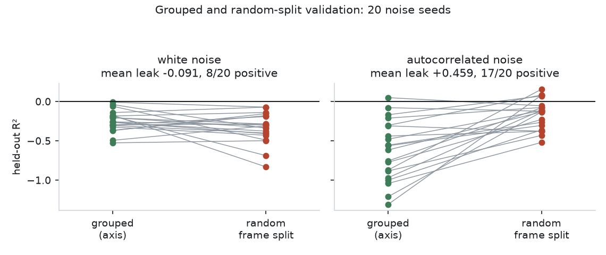

# CortexProbe

**Receptive fields · Synthetic data · Grouped validation · Uncertainty**

## Overview

Fit 2D Gaussian receptive fields to synthetic aperture responses. **No network or human data has been tested.**

### Data flow


```mermaid
flowchart LR
    A[Configuration] --> B[Bar / wedge / ring]
    B --> C[Synthetic responses]
    C --> D[Coarse search + refinement]
    D --> E[Grouped validation]
    E --> F[Tables + figures]
```

<p align="center"></p>

## Results

**64 px · 80 bar frames · 4 groups · 300 candidates · σ 1 to 10 px**

### Recovery

<!-- BEGIN GENERATED: recovery -->
| Condition | Position error, largest (px) | mean (px) | Sigma error, largest (%) | mean (%) | Minimum R² |
|---|---|---|---|---|---|
| Noiseless | 0.000 | 0.000 | 0.0 | 0.0 | 1.0000 |
| 20% noise | 0.287 | 0.197 | 5.2 | 2.3 | 0.9696 |
| 50% noise | 0.772 | 0.511 | 12.8 | 5.6 | 0.8326 |
| Pure noise | n/a | n/a | n/a | n/a | **40 / 40 rejected** |

<sub>n = 5, shared noise seed 7; pure noise 0/40 accepted (best R² 0.1947, threshold 0.2). Recorded on macOS-26.6.1 arm64, Python 3.12.13, NumPy 2.5.2, SciPy 1.18.0 | config digest `4d6a856a499e` | generated 2026-08-19</sub>
<!-- END GENERATED: recovery -->

<p align="center"></p>

### Uncertainty

<!-- BEGIN GENERATED: uncertainty -->
| Noise | Fitted x0 | SE | 95 % CI width |
|---|---|---|---|
| 0.0 | 12.000 | 0.0000 | 0.000 |
| 0.1 | 11.962 | 0.0961 | 0.383 |
| 0.3 | 11.909 | 0.2806 | 1.118 |
| 0.6 | 11.881 | 0.5354 | 2.133 |

| Position | Noise | n | Coverage | 95 % Wald CI |
|---|---|---|---|---|
| interior | 0.2 | 200 | 0.935 | [0.901, 0.969] |
| interior | 0.5 | 200 | 0.930 | [0.895, 0.965] |
| near edge | 0.2 | 200 | 0.930 | [0.895, 0.965] |
| near edge | 0.5 | 200 | 0.915 | [0.876, 0.954] |

<sub>Nominal 95%; paired seeds across cells; noiseless SE is a numerical floor. Recorded on macOS-26.6.1 arm64, Python 3.12.13, NumPy 2.5.2, SciPy 1.18.0 | config digest `4d6a856a499e` | generated 2026-08-19</sub>
<!-- END GENERATED: uncertainty -->

<p align="center"></p>

### Validation

<!-- BEGIN GENERATED: cross_validation -->
| Response | n seeds | Grouped CV | Random-split CV | Leak | Leak positive |
|---|---|---|---|---|---|
| White | 20 | -0.248 ± 0.135 | -0.339 ± 0.192 | -0.091 ± 0.231 | 8 / 20 |
| Autocorrelated | 20 | -0.624 ± 0.385 | -0.164 ± 0.189 | +0.459 ± 0.402 | 17 / 20 |

<sub>Mean ± SD, seeds 21-40; width-3 boxcar lag-1 0.651 ± 0.086 (theory 0.667). Recorded on macOS-26.6.1 arm64, Python 3.12.13, NumPy 2.5.2, SciPy 1.18.0 | config digest `4d6a856a499e` | generated 2026-08-19</sub>
<!-- END GENERATED: cross_validation -->

<p align="center"></p>

### Runtime

<!-- BEGIN GENERATED: runtime -->
| Units | Fit (s) | Per unit (ms) | CV (s) | CV factor |
|---|---|---|---|---|
| 1 | 0.009 | 8.5 | 0.040 | 4.7× |
| 10 | 0.078 | 7.8 | 0.391 | 5.0× |
| 100 | 0.792 | 7.9 | 3.978 | 5.0× |

<sub>Hardware timings; 4 folds plus the full fit; not remeasured by --check. Recorded on macOS-27.0.1 arm64, Python 3.12.13, NumPy 2.5.3, SciPy 1.18.1 | config digest `4d6a856a499e` | generated 2026-10-06</sub>
<!-- END GENERATED: runtime -->

[Recorded configuration](configs/validation.json) · [Numeric record](outputs/validation.json) · [All figures](outputs/)

## Method

| Step | Contract |
|---|---|
| Prediction | Gaussian × aperture; sum over pixels |
| Fit | Search x, y, σ; project amplitude and baseline |
| Acceptance | Converged; R² threshold; positive amplitude; σ off bounds |
| Validation | Whole sweep groups; overlap pruning; distinct frame degrees of freedom |
| Uncertainty | Local Jacobian; singular geometry gives undefined standard errors |
| Normalization | Amplitude convention; free amplitude absorbs peak versus volume scaling |

## Verify

```sh
python -m pip install -e '.[dev,viz]'
python -m pytest --cov
python -m ruff check .
python -m mypy
python scripts/generate_validation_report.py --check
python scripts/generate_figures.py
```

Use `PRFFitter.fit_unit(response)` or `fit_all(activations)` with `(frames, units)` arrays. `CrossValidator` requires one finite group label per frame.

## Tech stack

| Task | Tool |
|---|---|
| Numerics | Python 3.9+; NumPy; SciPy |
| Figures | Matplotlib |
| Checks | pytest; Ruff; strict mypy; coverage floor 85% |

## Limits

1. Synthetic only: 5 known fields share one noise seed per condition. Network depth, lesions and seed variation remain untested.
2. Intervals use a local approximation; coverage uses 200 trials per cell with shared seeds. No pooled independent trial claim.
3. The σ ceiling guards centered fields; edges truncate mass. A single Gaussian can miss multiple lobes; its diagnostic has no universal cutoff.

## References

| Reference | Use |
|---|---|
| [Dumoulin & Wandell, 2008](https://doi.org/10.1016/j.neuroimage.2007.09.034) | Moving aperture pRF method; adapted without haemodynamic convolution, in pixels |
| [Kriegeskorte et al., 2009](https://doi.org/10.1038/nn.2303) | Independent selection and validation |
| [SciPy least squares](https://docs.scipy.org/doc/scipy/reference/generated/scipy.optimize.least_squares.html) | Bounded refinement |
| [SciPy covariance guidance](https://docs.scipy.org/doc/scipy/reference/generated/scipy.optimize.curve_fit.html) | Rank and linear approximation limits |

[MIT License](LICENSE) · [Citation](CITATION.cff)
